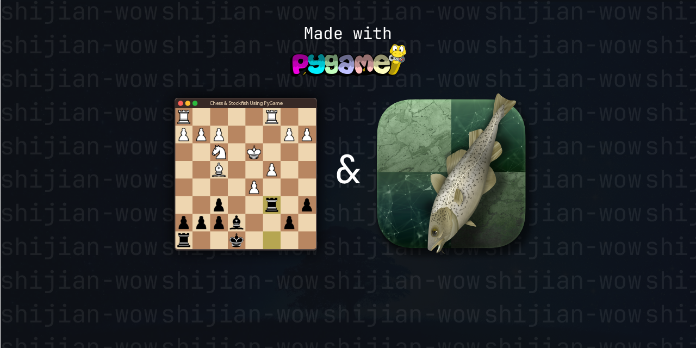

# Chess against Stockfish



## Introduction

Welcome to Chess against Stockfish! This is a simple chess game that allows you to play against the powerful Stockfish engine. The game features various sounds to enhance your experience, including move-self sounds, check sounds, checkmate sounds, game start and end sounds, and capture sounds.

[]()
[](https://opensource.org/licenses/MIT)

[](https://GitHub.com/shijian-wow/Python-Chess-GUI/releases/)

## Requirements

To run this game, you will need the following:

- Python installed on your computer
- requirements.txt installed

To install the game, simply download the zip file from `releases` and extract its contents to a directory on your computer. Then, open a terminal or command prompt and navigate to the directory where you extracted the files. Type `python main.py` to launch the game.

### How to install requirements.txt?

This requires `pip` installed, If you have pip then simply go to directory you have extracted zip file then open CMD or Command Line in same directory and then type the below things

```cmd
pip install -r requirements.txt
```

## Minimum System Requirements

> ### Windows & Linux-Ubuntu
> https://en.wikipedia.org/wiki/Advanced_Vector_Extensions#CPUs_with_AVX2

## Gameplay

The game sometimes starts with Stockfish move as white, It depends on your FEN code, that means sometimes Stockfish would not start first but it's always white

One of best features of this project that you can import a FEN code and start playing against Stockfish engine

If you want to promote a pawn to a queen, rook, bishop, or knight, press one of the following keys:

'q' for queen
'r' for rook
'n' for knight
'b' for bishop

And then click on the promotion square

## Sounds

The game includes several sounds to enhance your experience:

- Move-self sounds: When you move a piece, you will hear a sound indicating which piece you moved.
- Check sounds: When you put the opponent's king in check, you will hear a sound alerting you to the fact.
- Checkmate sounds: When you checkmate the opponent's king, you will hear a victory fanfare.
- Game start and end sounds: At the beginning and end of each game, you will hear a brief musical flourish.
- Capture sounds: When you capture an opponent's piece, you will hear a sound effect indicating the capture.

## Keyboard Shortcuts

The following keyboard shortcuts are available during gameplay:

'T': Reset the board to default.
Esc or Close Button: Exit the game.

## Issuses

If there's something wrong with the project, Feel free to create an issuse in issuses section

## License

This game is released under the MIT License. See LICENSE.txt for more information.
