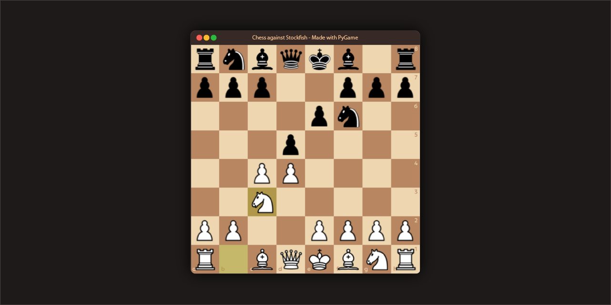
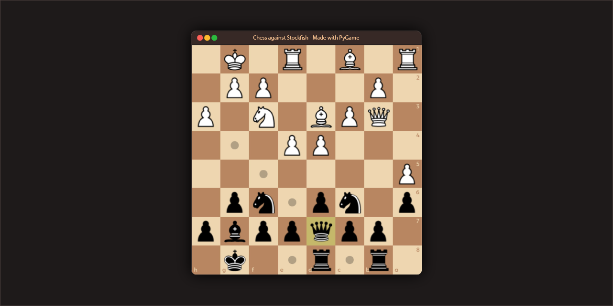

<!--
Thanks for visiting this project

  Author:
      shijian-wow@github, https://github.com/shijian-wow
  
  Details:
      This project made with Love by shijian-wow@github, if you want to see more
      projects which those made by me, check out https://github.com/shijian-wow
  
  License:
      This project is licensed under MIT license, and here is the license content:
  
          MIT License
      
          Copyright (c) 2024 shijian-wow
          
          Permission is hereby granted, free of charge, to any person obtaining a copy
          of this software and associated documentation files (the "Software"), to deal
          in the Software without restriction, including without limitation the rights
          to use, copy, modify, merge, publish, distribute, sublicense, and/or sell
          copies of the Software, and to permit persons to whom the Software is
          furnished to do so, subject to the following conditions:
          
          The above copyright notice and this permission notice shall be included in al
          copies or substantial portions of the Software.
          
          THE SOFTWARE IS PROVIDED "AS IS", WITHOUT WARRANTY OF ANY KIND, EXPRESS OR
          IMPLIED, INCLUDING BUT NOT LIMITED TO THE WARRANTIES OF MERCHANTABILITY,
          FITNESS FOR A PARTICULAR PURPOSE AND NONINFRINGEMENT. IN NO EVENT SHALL THE
          AUTHORS OR COPYRIGHT HOLDERS BE LIABLE FOR ANY CLAIM, DAMAGES OR OTHER
          LIABILITY, WHETHER IN AN ACTION OF CONTRACT, TORT OR OTHERWISE, ARISING FROM,
          OUT OF OR IN CONNECTION WITH THE SOFTWARE OR THE USE OR OTHER DEALINGS IN THE
          SOFTWARE.
-->

# Chess against Stockfish

This project made for playing chess against **Stockfish**. You don't have to worry about performance in new versions (0.2.0+) because performance problem has been solved.

## Features

### Generals

* **Drag and drop pieces** - You can drag pieces and drop them to move your pieces if it's legal.
* **Sound effects** -
This project contains sound effects to improve your game experience.

### Game modes

* **Singleplayer** - You can play with your friends or family members.
* **Multiplayer** - You can play with your friends or family members.
* **Bot versus itself** - You can watch stockfish while playing against itself.

## Installation

To install the chess game, you need to install **Python3** and required libraries. So let's get started:

1. Download and install **Python3** (version 311 is recommended).

2. Open a command line.

3. Install required libraries using one of following commands:

~~~~~~~~~~~~~~~markdown
* (If you prefer using Makefile)
$ make install-deps

* (On Windows systems)
$ pip install -r equirements.txt

* (On Linux systems)
$ pip3 install -r requirements.txt
~~~~~~~~~~~~~~~

4. Extract the zip file that you downloaded from the releases.

5. Enjoy playing chess against Stockfish, if you don't know how to play game, see [Usage](#usage) section.

## Usage

### How to execute/run game?

To execute the game, you must install dependencies first, if you don't know how to install it see [Installation](#installation)
section to install.

If you have installed all dependencies then open a command line, and use one of following commands to execute game:

~~~~~~~~~~~~~~~markdown
* (If you prefer using Makefile)
$ make run

* (On Windows systems)
$ py chess-gui.py [OPTION]

* (On Linux systems)
$ python3 chess-gui.py [OPTION]
~~~~~~~~~~~~~~~

Replace [OPTION] with optional arguments relevant to your usage.

### Optional arguments

 Options | Description | Valid values
---------|-------------|--------------
 --fen, --starting-fen or --board-starting-fen | this option defines the starting fen of board. | An valid fen code
 --game-type | this option defines the type of game | `singleplayer`, `multiplayer` or `bot_versus_itself`
 --color | this option defines your color, and this only works in `singleplayer` mode | `white` or `black`

## Gameplay preview

## Open source libraries

* [**PyGame**](https://github.com/pygame/pygame/) - Open Source python programming language
library for making multimedia applications like games built on top of the excellent SDL
library. C, Python, Native, OpenGL.

* [**python-chess**](https://github.com/niklasf/python-chess/) - A chess library for
Python, with move generation and validation, PGN parsing and writing, Polyglot opening
book reading, Gaviota tablebase probing, Syzygy tablebase probing, and UCI/XBoard engine
communication.

* [**Click**]() - Python composable command line interface toolkit.
